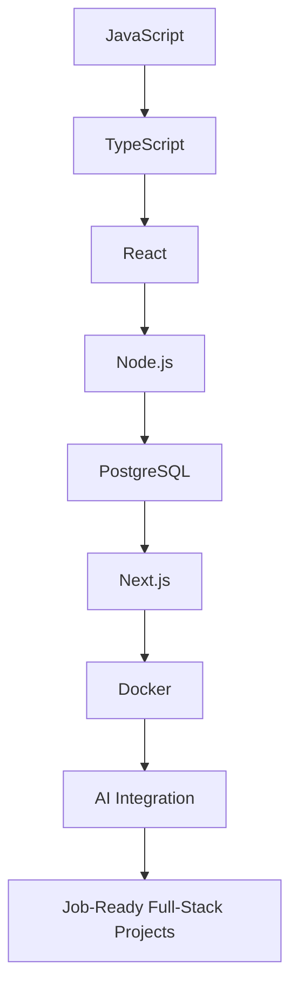

<h1 align="center">Hey 👋, I'm Afzal Hossain Miraz</h1>

<h3 align="center">
  CSE Undergraduate Student • Frontend Developer • Aspiring Full-Stack Developer
</h3>

<p align="center">
  Building clean, responsive, and practical web projects while learning full-stack development step by step.
</p>

<p align="center">
  
</p>

---

## 🧑‍💻 About Me

```js
const miraz = {
  fullName: "Afzal Hossain Miraz",
  role: "CSE Undergraduate Student",
  currentFocus: "Frontend Development",
  goal: "Become a job-ready full-stack developer before graduation",
  comfortableWith: ["HTML", "CSS", "Tailwind CSS", "JavaScript"],
  learning: ["TypeScript", "React", "Node.js", "PostgreSQL", "Next.js"],
  futureFocus: ["Docker", "Linux Basics", "AI Integration"],
  currentProjects: [
    "SkillBridge / FreelanceHub",
    "Payo Mobile Banking",
    "TechWave Landing Page"
  ],
  mindset: "Learning by building real projects"
};
```

---

## 🚀 Current Journey

- 🎓 Currently pursuing **Computer Science & Engineering**
- 🎯 Goal: Become a **job-ready full-stack developer before graduation**
- 🎨 Building responsive frontend projects with **HTML, CSS, Tailwind CSS, and JavaScript**
- ⚡ Practicing **JavaScript, DOM manipulation, and real project logic**
- 🌱 Learning **React** and moving toward backend development step by step
- 🧠 Interested in **problem solving, backend development, clean UI, and AI-powered apps**
- 🛠️ Building real projects like **SkillBridge**, **Payo Mobile Banking**, and **TechWave**
- 📫 Reach me at: **afzalhossain.miraz@gmail.com**

---

## 🛣️ My Full-Stack Roadmap

I do not want to learn everything randomly.  
My plan is to learn one stack deeply and build real-world projects step by step.



---

## 🛠️ Current + Learning Stack

<p align="center">
  
</p>

---

## 📌 Featured Projects

### 🔹 SkillBridge / FreelanceHub  
A freelancing platform project focused on job/service exploration, user-friendly pages, and real-world web application structure.  

**Tech:** HTML, CSS, Tailwind CSS, JavaScript  
**Repository:** [FreelanceHub](https://github.com/NobodyWasStark/FreelanceHub)

---

### 🔹 Payo Mobile Banking  
A mobile banking web app project built to practice JavaScript logic, DOM manipulation, balance updates, and user interactions.  

**Tech:** HTML, CSS, JavaScript  
**Repository:** [payo-code](https://github.com/miraz-ai/payo-code)

---

### 🔹 TechWave Landing Page  
A modern responsive landing page focused on clean layout, spacing, sections, and frontend design.  

**Tech:** HTML, CSS  
**Repository:** [assignment-2](https://github.com/miraz-ai/assignment-2)

---

### 🔹 Portfolio Responsive  
A responsive portfolio website to showcase projects, skills, and learning journey.  

**Tech:** HTML, CSS  
**Repository:** [portfolio-responsive](https://github.com/miraz-ai/portfolio-responsive)

---

### 🔹 DOM Recap  
A JavaScript practice project focused on DOM manipulation and interactive webpage behavior.  

**Tech:** HTML, CSS, JavaScript  
**Repository:** [DOM-Recap-](https://github.com/miraz-ai/DOM-Recap-)

---

### 🔹 G3 Architects Website  
A responsive landing page project focused on layout, spacing, and modern UI design.  

**Tech:** HTML, CSS  
**Repository:** [g3-architects-website](https://github.com/miraz-ai/g3-architects-website)

---

## 📊 GitHub Activity

<p align="center">
  
</p>

<p align="center">
  
</p>

<p align="center">
  
</p>

---

## 🎯 2026 Goals

- Strengthen **JavaScript fundamentals**
- Learn **React** properly
- Start backend development with **Node.js**
- Learn database basics with **PostgreSQL**
- Build one complete **full-stack project**
- Improve GitHub project documentation
- Practice problem solving regularly
- Explore **AI integration** in web apps

---

## 🌐 Connect With Me

<p align="center">
  <a href="https://github.com/miraz-ai" target="_blank">
    
  </a>

  <a href="mailto:afzalhossain.miraz@gmail.com">
    
  </a>

  <a href="https://www.instagram.com/_mirzmyth?igsh=eXBvbXZxNGtuYnc3&utm_source=qr" target="_blank">
    
  </a>

  <a href="https://www.facebook.com/share/1Yc7BVLkSP/?mibextid=wwXIfr" target="_blank">
    
  </a>

  <a href="https://x.com/eren8mi?s=21" target="_blank">
    
  </a>
</p>

---

<p align="center">
  <b>“Small projects today. Strong developer tomorrow.”</b>
</p>
